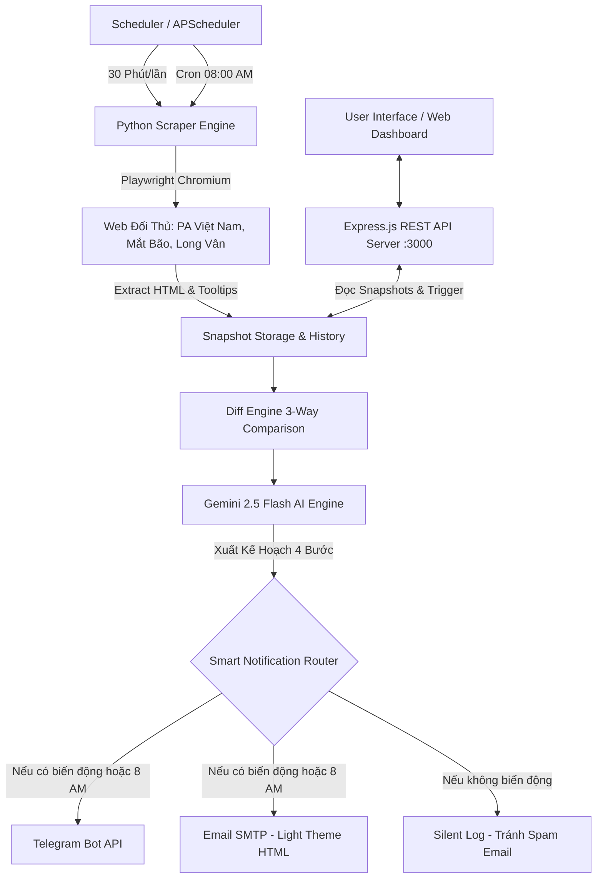

# 🚀 Market AI Engine — Competitive Market Intelligence & Pricing Tracker

**Market AI Engine** là hệ thống tự động hóa toàn diện giúp giám sát, phân tích biến động giá và đối soát chiến lược giá tên miền 3 chiều giữa **LONG VÂN CLOUD (Benchmark)** và các đối thủ trực tiếp (**Mắt Bão**, **PA Việt Nam**). 

Hệ thống tích hợp trí tuệ nhân tạo **Gemini 2.5 Flash AI**, công nghệ cào dữ liệu tự động **Playwright Anti-Detect Headless**, giao diện **Dashboard trực quan (Express/REST API)** và hệ thống **Cảnh báo Kép Đa Kênh (Email Light Theme + Telegram Bot)**.

---

## 📋 MỤC LỤC
1. [Tính Năng Cốt Lõi](#-tính-năng-cốt-lõi)
2. [Kiến Trúc & Luồng Hoạt Động (Architecture & Workflow)](#-kiến-trúc--luồng-hoạt-động-architecture--workflow)
3. [Cơ Chế Báo Cáo Kép Thông Minh (Hybrid Notification System)](#-cơ-chế-báo-cáo-kép-thông-minh-hybrid-notification-system)
4. [Động Cơ Đối Soát 3 Chiều & Phân Tích Gemini AI](#-động-cơ-đối-soát-3-chiều--phân-tích-gemini-ai)
5. [Cấu Trúc Thư Mục Dự Án](#-cấu-trúc-thư-mục-dự-án)
6. [Cấu Hình Môi Trường (.env)](#-cấu-hình-môi-trường-env)
7. [Hướng Dẫn Cài Đặt & Chạy Tại Local](#-hướng-dẫn-cài-đặt--chạy-tại-local)
8. [Hướng Dẫn Triển Khai Lên VPS & Cloudflare](#-hướng-dẫn-triển-khai-lên-vps--cloudflare)
9. [Cấu Hình CI/CD GitHub Actions](#-cấu-hình-cicd-github-actions)
10. [Hệ Thống REST API Documentation](#-hệ-thống-rest-api-documentation)
11. [Xử Lý Lỗi & Xử Lý Sự Cố (Troubleshooting)](#-xử-lý-lỗi--xử-lý-sự-cố-troubleshooting)

---

## ✨ TÍNH NĂNG CỐT LÕI

- 🕷️ **Playwright Anti-Detect Scraping**: Giả lập trình duyệt Chromium thực tế, bóc tách chính xác 100% các ô bảng giá phức tạp, giá khuyến mãi năm 1, phí gia hạn ẩn trong Tooltipster (`512.000đ` PA Việt Nam) và tự động chụp ảnh màn hình làm bằng chứng đối soát.
- 📐 **Động cơ Đối soát 3 Chiều (3-Way Diff Engine)**:
  - **Giá Đăng Ký (Năm 1)**.
  - **Giá Gia Hạn Hàng Năm (Từ năm 2)**.
  - **Tổng Chi Phí 2 Năm (Năm 1 + Gia hạn)** — Tiêu chí vàng đánh giá mức giá cao / thấp thực tế của từng nhà cung cấp.
  - **Độ phủ TLD (TLD Availability)**: Nhận diện TLD ngách độc quyền của Long Vân & TLD mà Long Vân đang bỏ lỡ so với đối thủ.
- 🧠 **Gemini 2.5 Flash AI Analyzer**: Phân tích ý đồ đối thủ (Kích cầu cướp thị phần hay tăng giá tối ưu lợi nhuận) và xuất ra **Kế hoạch hành động 4 bước cụ thể (Step-by-Step Action Plan)** cho team Long Vân.
- 📬 **Cảnh Báo Kép Thông Minh (Hybrid Multi-Channel)**:
  - ☀️ **Bản tin sáng 8h00**: Phát báo cáo tổng quan vị thế toàn thị trường + xác nhận hệ thống sống khỏe 24/7.
  - 🚨 **Cảnh báo tức thì 24/7 (Silent Mode)**: Quét ngầm mỗi 30 phút. Chỉ phát tin báo về Email & Telegram ngay khi có đối thủ điều chỉnh giá hoặc ra mắt TLD mới.
- 💻 **Dashboard Quản Trị Đa Tiêu Chí**: Giao diện sáng chuẩn Doanh nghiệp, chọn bộ lọc tiêu chí so sánh, xem biểu đồ vị thế, chi tiết từng TLD và nút trigger cào dữ liệu/gửi báo cáo tức thì.
- 🐳 **Đóng Gói Docker & CI/CD**: Hỗ trợ Docker Compose kép (Python + Node.js) và tự động Deploy lên VPS thông qua GitHub Actions.

---

## 🏗 KIẾN TRÚC & LUỒNG HOẠT ĐỘNG (ARCHITECTURE & WORKFLOW)



---

## ⏱️ CƠ CHẾ BÁO CÁO KÉP THÔNG MINH (HYBRID NOTIFICATION SYSTEM)

Hệ thống vận hành theo **2 cơ chế kết hợp song song**:

1. **☀️ Bản Tin Sáng 8h00 (Daily Morning Briefing)**:
   - Tự động chạy lúc **08:00 AM** hàng ngày.
   - Gửi báo cáo toàn diện tới Email & Telegram để xác nhận hệ thống 24/7 đang hoạt động tốt (Heartbeat check) và tổng hợp vị thế giá cạnh tranh đầu ngày.

2. **🚨 Cảnh Báo Ngầm Tức Thì (Instant Change Incident Alert - Silent Mode)**:
   - Hệ thống quét ngầm định kỳ mỗi **30 phút/lần** (hoặc thời gian tùy chỉnh).
   - **Nếu bảng giá đối thủ ổn định (không đổi)**: Hệ thống im lặng cập nhật dữ liệu ngầm, **KHÔNG gửi email/telegram** để tránh rác hòm thư.
   - **Nếu phát hiện BIẾN ĐỘNG GIÁ hoặc TLD MỚI**: Hệ thống kích hoạt cảnh báo đỏ gửi ngay Telegram + Email kèm Kế hoạch 4 bước của AI.

---

## 📊 ĐỘNG CƠ ĐỐI SOÁT 3 CHIỀU & PHÂN TÍCH GEMINI AI

### 1. Tiêu chuẩn So sánh 3 Chiều
Hệ thống không chỉ so sánh giá năm đầu (vốn thường bị làm mờ bởi chiêu trò KM), mà quy đổi về **3 chỉ số tài chính**:

$$\text{Tổng chi phí 2 năm} = \text{Giá Đăng Ký Năm 1} + \text{Giá Gia Hạn Từ Năm 2}$$

Ví dụ thực tế TLD `.vn`:
* **PA Việt Nam**: Đăng ký 450.000đ + Gia hạn 512.000đ = **962.000đ / 2 năm**.
* **Long Vân**: Đăng ký 450.000đ + Gia hạn 460.000đ = **910.000đ / 2 năm**.
* ➔ **Vị thế**: Long Vân tiết kiệm hơn PA Việt Nam **52.000đ/năm**.

### 2. Kế hoạch Hành động 4 Bước của AI (Step-by-Step Action Plan)
Gemini AI nhận dữ liệu đối soát và trả về JSON chứa kế hoạch hành động:
* **Bước 1 [Chính sách Giá đối ứng]**: Đề xuất mức voucher / giảm giá cho nhóm TLD bị đối thủ ép giá.
* **Bước 2 [Chiến dịch Marketing]**: Đưa ra thông điệp truyền thông cốt lõi (Ví dụ: *"Gia hạn .vn tại Long Vân giá thấp hơn đối thủ 52.000đ/năm"*).
* **Bước 3 [Đóng gói Combo Dịch vụ]**: Tặng kèm Voucher Cloud Hosting / Email Server Pro 1GB.
* **Bước 4 [Đo lường & Kiểm soát]**: Thời gian đánh giá tỷ lệ chuyển đổi sau 14 - 30 ngày.

---

## 📂 CẤU TRÚC THƯ MỤC DỰ ÁN

```text
market-ai/
├── Dockerfile                  # Dockerfile đa môi trường (Python 3.12 + Node.js 20 + Playwright Chromium)
├── docker-compose.yml          # Container orchestration (Dashboard + Scheduler)
├── requirements.txt            # Python dependencies
├── package.json                # Node.js dependencies
├── .env.example                # File mẫu cấu hình biến môi trường
├── .gitignore                  # Loại bỏ file nhạy cảm và rác build
├── main.py                     # CLI Orchestrator cào dữ liệu
├── scheduler.py                # Service APScheduler chạy ngầm 24/7 & 8h sáng
├── config/
│   └── crawler_targets.json    # Công tắc bật/tắt mục tiêu cào
├── core/
│   ├── base_provider.py        # Lớp cơ sở Playwright Anti-Detect Browser
│   ├── diff_engine.py          # Lõi so sánh 3-way & TLD availability
│   ├── ai_analyzer.py          # Gemini 2.5 Flash AI Engine + MD5 Cache
│   ├── telegram_notifier.py    # Gửi Telegram (tối ưu giới hạn 4000 chars)
│   └── email_notifier.py       # Gửi Email HTML Light Theme cao cấp
├── providers/
│   ├── longvan/domain.py       # Scraper Benchmark Long Vân
│   ├── matbao/domain.py        # Scraper đối thủ Mắt Bão
│   └── pavietnam/domain.py     # Scraper đối thủ PA Việt Nam (Bóc tách Tooltipster API)
├── dashboard/
│   ├── server.js               # Node.js Express REST API Server
│   └── public/                 # Giao diện Web Dashboard (HTML5, Vanilla CSS, JS)
├── storage/                    # Persistent Storage Volume
│   ├── snapshots/              # File lưu giá JSON hiện tại & lịch sử
│   ├── screenshots/            # Ảnh chụp bằng chứng giao diện đối thủ
│   └── ai_cache/               # Cache câu trả lời AI
└── .github/workflows/
    └── deploy.yml              # Pipeline CI/CD tự động Deploy VPS
```

---

## ⚙️ CẤU HÌNH MÔI TRƯỜNG (.ENV)

Tạo file `.env` ở thư mục gốc từ `.env.example`:

```env
# MÚI GIỜ
TZ=Asia/Ho_Chi_Minh

# TELEGRAM BOT
TELEGRAM_BOT_TOKEN=8640765672:AAGyh6wPrFIOVKQcxptK08AmK5gwmRcYJkY
TELEGRAM_CHAT_ID=8696947463

# EMAIL SMTP (GMAIL)
SMTP_HOST=smtp.gmail.com
SMTP_PORT=587
SMTP_USER=your_email@gmail.com
SMTP_PASSWORD=fhvt xxyx lgxx xpqo  # Mật khẩu ứng dụng App Password 16 ký tự
EMAIL_FROM=your_email@gmail.com
EMAIL_TO=recipient@gmail.com

# GEMINI AI API KEY
GEMINI_API_KEY=your_gemini_api_key

# TẦN SUẤT QUÉT
CRAWL_INTERVAL_MINUTES=30
CRAWL_INTERVAL_SECONDS=0    # Đặt > 0 khi cần TEST cào 30 giây/lần

# POSTGRESQL DATABASE (Tùy chọn)
POSTGRES_DB=market_ai
POSTGRES_USER=market
POSTGRES_PASSWORD=your_password
```

---

## 🚀 HƯỚNG DẪN CÀI ĐẶT & CHẠY TẠI LOCAL

### 1. Cài đặt môi trường Python & Node.js
```bash
# Cài đặt Python dependencies
pip install -r requirements.txt
playwright install chromium

# Cài đặt Node.js dependencies cho Dashboard
npm install
```

### 2. Chạy cào dữ liệu thủ công qua CLI
```bash
# Quét tất cả nhà cung cấp
python main.py --all

# Quét riêng PA Việt Nam
python main.py -p pavietnam -prod domain
```

### 3. Khởi chạy Dashboard Server
```bash
node dashboard/server.js
```
*Truy cập Dashboard tại:* `http://localhost:3000`

### 4. Khởi chạy Scheduler ngầm
```bash
python scheduler.py
```

---

## 🐳 HƯỚNG DẪN TRIỂN KHAI LÊN VPS & CLOUDFLARE

### 1. Đề xuất cấu hình VPS (Ví dụ: Long Vân Cloud Server)
- **CPU**: 2 vCPU
- **RAM**: 4 GB RAM (Tối thiểu 2GB RAM + 2GB Swap File)
- **SSD**: 30 GB SSD
- **OS**: Ubuntu 22.04 LTS

### 2. Triển khai bằng Docker Compose
```bash
# Clone code về VPS
git clone https://github.com/NhatDuonq/Market_AI.git /var/www/market-ai
cd /var/www/market-ai

# Tạo file .env
cp .env.example .env
nano .env  # Điền API Key và Mật khẩu thực tế

# Khởi chạy Docker
docker compose up -d --build
```

### 3. Cấu hình Nginx Reverse Proxy & SSL Miễn phí
Tạo file `/etc/nginx/sites-available/market-ai`:
```nginx
server {
    server_name eluto.io.vn www.eluto.io.vn;

    location / {
        proxy_pass http://localhost:3000;
        proxy_http_version 1.1;
        proxy_set_header Upgrade $http_upgrade;
        proxy_set_header Connection 'upgrade';
        proxy_set_header Host $host;
        proxy_cache_bypass $http_upgrade;
    }
}
```
Kích hoạt HTTPS SSL qua Certbot:
```bash
sudo ln -s /etc/nginx/sites-available/market-ai /etc/nginx/sites-enabled/
sudo systemctl reload nginx
sudo certbot --nginx -d eluto.io.vn -d www.eluto.io.vn
```

---

## ⚡ CẤU HÌNH CI/CD GITHUB ACTIONS

File `.github/workflows/deploy.yml` đã được thiết lập tự động. Mỗi khi push code lên nhánh `main`, GitHub Actions sẽ tự động SSH vào VPS, pull code mới nhất và rebuild Docker containers.

**Cần thêm 4 Repository Secrets trên GitHub Settings:**
- `VPS_HOST`: IP máy chủ VPS.
- `VPS_USERNAME`: Username SSH (VD: `root`).
- `VPS_SSH_KEY`: Nội dung Private Key SSH (`cat ~/.ssh/id_rsa`).
- `VPS_PROJECT_PATH`: `/var/www/market-ai`.

---

## 🌐 HỆ THỐNG REST API DOCUMENTATION

| Method | Endpoint | Mô tả |
| :--- | :--- | :--- |
| **`GET`** | `/api/compare/:provider` | Lấy dữ liệu đối soát 3 chiều giữa Long Vân và `:provider` (`pavietnam`, `matbao`). |
| **`POST`** | `/api/trigger/all` | Kích hoạt lượt cào tất cả nhà cung cấp ngay lập tức. |
| **`POST`** | `/api/trigger/:provider/:product` | Kích hoạt cào nhà cung cấp cụ thể. |
| **`POST`** | `/api/send-report` | Kích hoạt tổng hợp báo cáo và gửi về Email & Telegram ngay lập tức. |
| **`GET`** | `/api/crawl/status` | Lấy trạng thái công tắc cào dữ liệu của từng nhà cung cấp. |

---

## 🔧 XỬ LÝ LỖI & TROUBLESHOOTING

1. **Lỗi Playwright không chạy được trên VPS**:
   - Chạy lệnh cài đặt OS dependencies: `npx playwright install-deps` hoặc dùng Docker container đi kèm.
2. **Lỗi Email Gmail bị từ chối đăng nhập (SMTPAuthenticationError)**:
   - Phải sử dụng **App Password (Mật khẩu ứng dụng 16 ký tự)** của Gmail, không dùng mật khẩu Gmail chính. Lấy tại: `https://myaccount.google.com/apppasswords`.
3. **Tràn bộ nhớ RAM trên VPS 2GB**:
   - Thêm Swap file 2GB: `sudo fallocate -l 2G /swapfile && sudo chmod 600 /swapfile && sudo mkswap /swapfile && sudo swapon /swapfile`.

---

© 2026 **Market AI Project** — Developed for **LONG VÂN CLOUD SOLUTION**. All rights reserved.
